# Brickhack 2020

I made this to explore functional programming as applied to generative art. I suspect it will be shortly abandoned, and I am certain that the code is of below average quality. However, here ya go!

## Usage

My process for interactively building this app was running `clojure -m figwheel.main -b dev` from the main directory and editing the namespace specified in `dev.cljs.edn`. I make no guarantees about this code, it is presented as is to the world. If you would like to take it and do with it as you see fit, feel free to do so (though I advise against it).

## Images
In this regard the app was quite successful. Below are some screenshots:

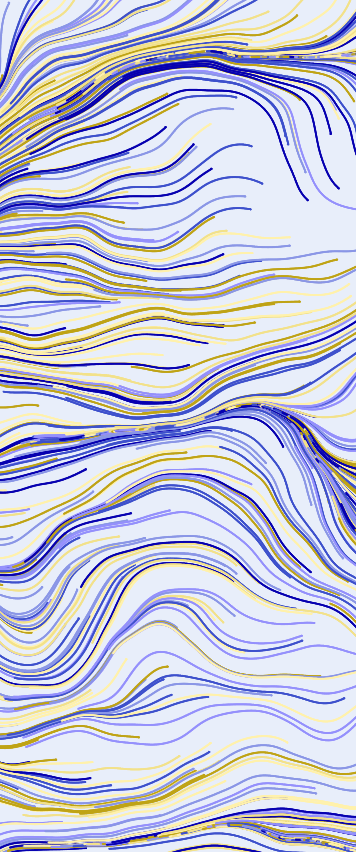 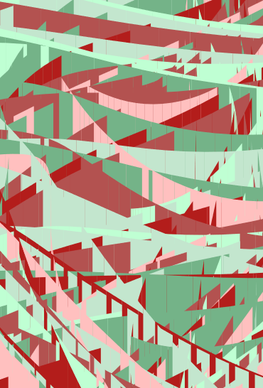
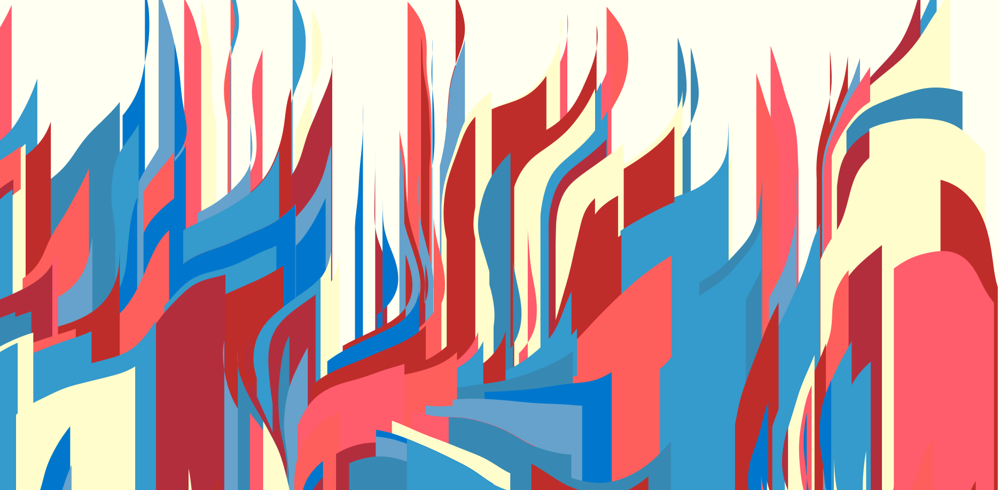
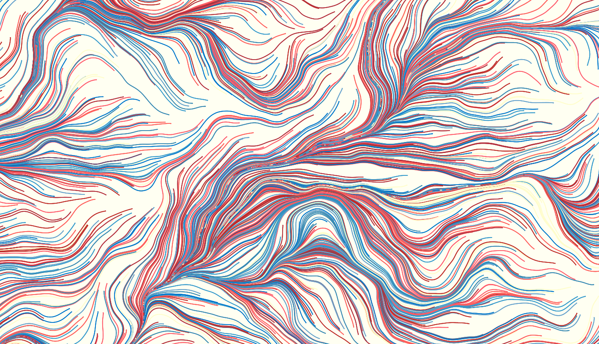
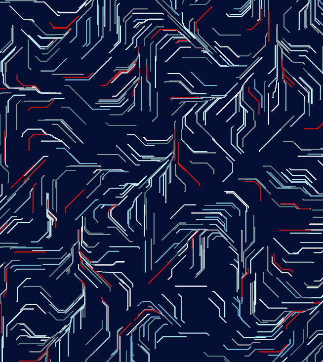
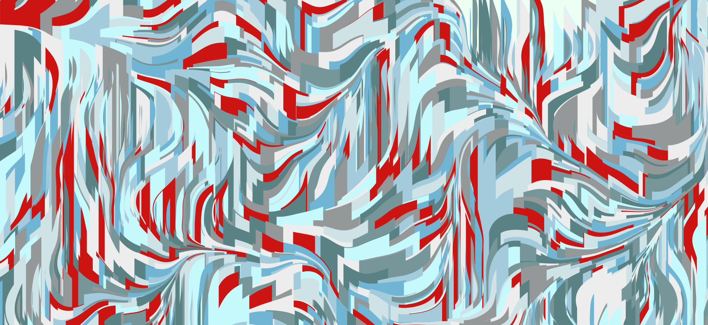
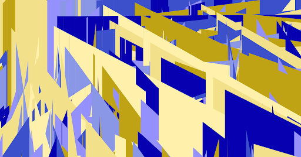
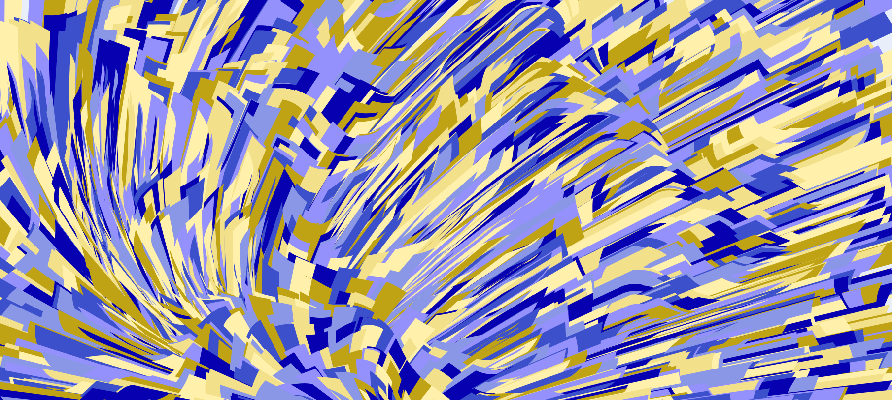

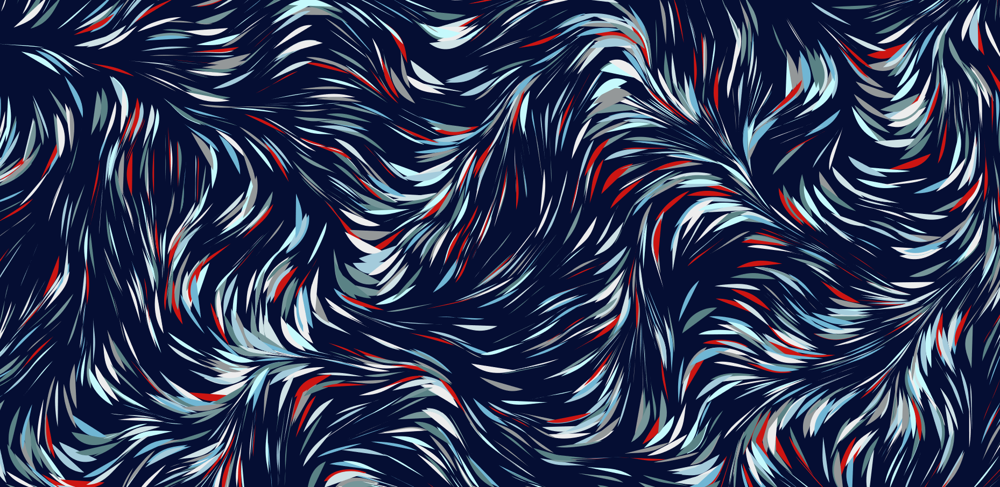
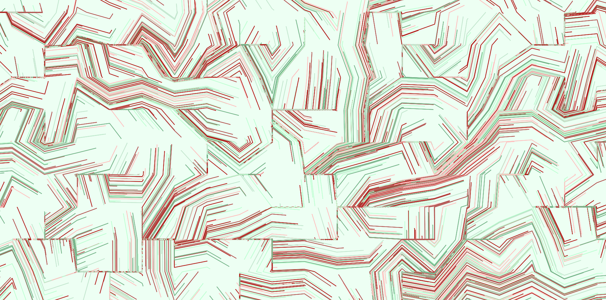
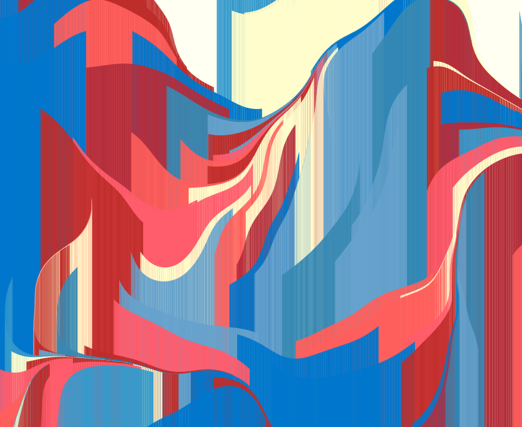
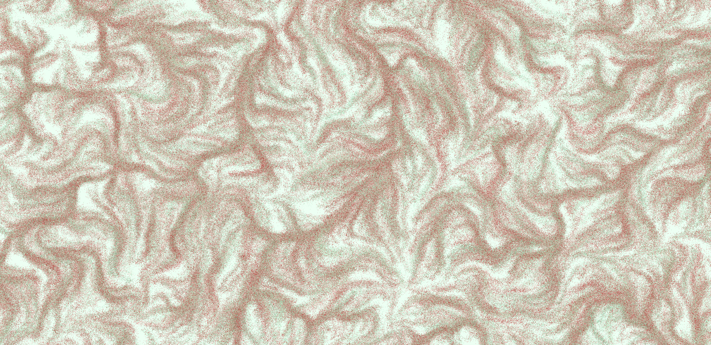
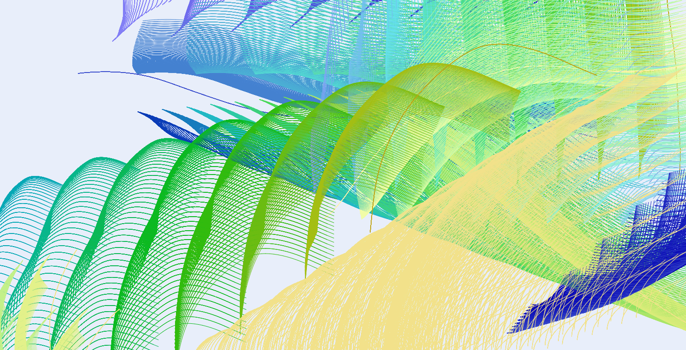
